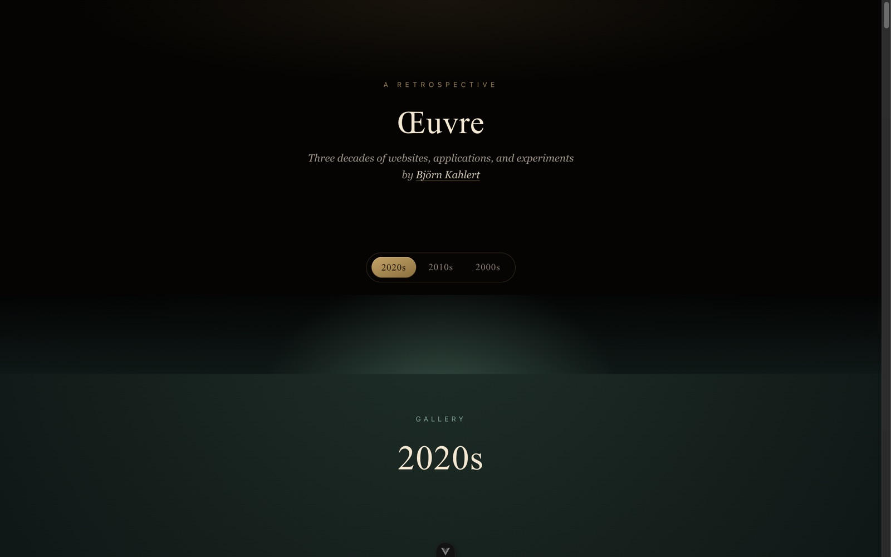
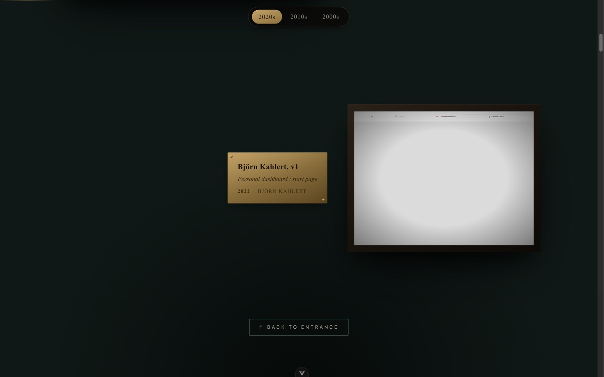
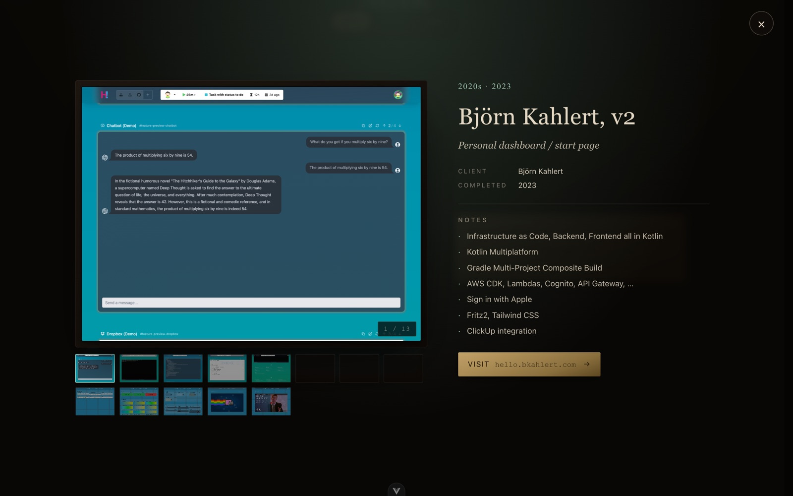

# Museum

A Vue 3 retrospective of three decades of websites, applications, and experiments by [Björn Kahlert](https://bkahlert.com) — presented as a literal museum: an entrance hall, decade-grouped galleries, framed exhibits with brass plaques, and a closing room.

[](https://github.com/bkahlert/museum/actions/workflows/build.yml)
[](https://hub.docker.com/r/bkahlert/museum)

---



## Features

- **Entrance hall** — title plate sets the tone before the work begins
- **Decade galleries** — exhibits grouped by 2000s / 2010s / 2020s, descending; each gallery has a brass threshold plaque and accent lighting
- **Framed walls** — alternating left/right layouts, gold-on-mahogany plaques, photo-frame depth
- **Detail view** — click an exhibit to enter; click the photo to cycle, mouse-wheel to step forward and back
- **Sticky decade nav** — pops out of the entrance and pins to the top while you scroll
- **Static, runtime-loaded data** — `public/references.json` is fetched at runtime, so curated edits propagate without a rebuild
- **Docker-ready** — single `nginx:alpine` container, multi-arch image on Docker Hub

## Prerequisites

| Requirement | Version        |
|-------------|----------------|
| Node.js     | 20+            |
| npm         | 10+            |
| Docker      | any (optional) |

## Development

```sh
npm install
npm run dev        # Vite dev server at http://localhost:5173
```

Edits to `public/references.json` are picked up on the next page load — no rebuild required.

## Build

```sh
npm run build      # type-check + vite build → dist/
npm run preview    # preview the built bundle
```

## Docker

```sh
# Build
docker build -f deploy/Dockerfile -t museum .

# Run
docker run --rm -p 8080:8080 museum
open http://localhost:8080
```

## Container image

Pre-built multi-arch images (`linux/amd64`, `linux/arm64`) are published to Docker Hub:

<https://hub.docker.com/r/bkahlert/museum>

```bash
docker run --rm -p 8080:8080 bkahlert/museum:latest
```

Tags: `latest` tracks `main`; `vX.Y.Z` and `X.Y` track semver release tags; `sha-<short>` pins to a specific commit.

## Adding or editing exhibits

1. Drop photos into `public/references/` (e.g. `42.Home.jpg`, `42.Detail.jpg`).
2. Append an entry to `public/references.json`:

   ```jsonc
   {
     "id": "42",
     "title": "…",
     "description": "…",
     "client": "…",
     "url": "example.com",
     "completion_date": "2024-05-01",
     "show_as_reference": true,
     "active": true,
     "photos": ["42.Home.jpg", "42.Detail.jpg"],
     "notes": ["Highlights of the project"]
   }
   ```

Only entries with `show_as_reference: true` appear. The decade is derived from `completion_date`.

## Gallery

<figure>
  
  <figcaption>A decade gallery — alternating walls, gold-on-mahogany plaques</figcaption>
</figure>

<figure>
  
  <figcaption>Exhibit detail — click photo to cycle, wheel to step</figcaption>
</figure>

## License

MIT
